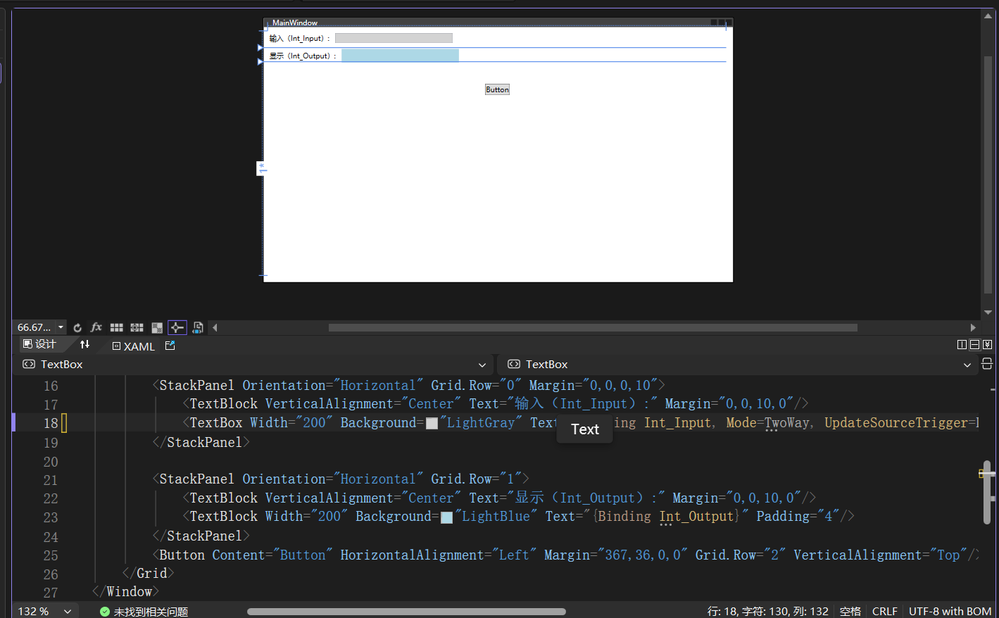

# <center> 一 WPF环境搭建 </center>
## 1.1软件安装
    使用软件Visual Studio 2026 ，官网下载安装包，安装时勾选上“.NET桌面开发”和“.NET桌面开发（通用）”两个选项，然后点击“安装”按钮，等待安装完成。
## 1.2项目创建
    安装完成后，打开Visual Studio 2026，点击“创建新项目”按钮，选择“WPF应用程序”模板（使用默认.10版本即可），然后点击“下一步”按钮，输入项目名称和位置，然后点击“创建”按钮，等待项目创建完成。

## 1.3项目运行
    创建完成后，打开项目文件夹，可以看到项目文件夹下有.xmal文件和.cs文件，双击.xmal文件，可以看到界面布局，双击.cs文件，可以看到界面逻辑，然后点击“运行”按钮，可以看到界面运行效果。.cs文件使用C#语言编写，.xmal文件使用XAML语言编写，XAML语言是一种标记语言，用于描述界面布局，C#语言是一种编程语言，用于编写界面逻辑。
    前后端变量可进行互通，或者在.xmal文件中使用{Binding}的方式进行互通，或者在.cs文件中使用DataContext A.b的方式进行互通。详情可见下一节。


# <center> 二 前后端框架介绍 </center>
## 2.1xmal程序框架介绍

 .xmal负责编写前端，虽然可通过直接拖拽的方式引入控件，但主要方式还是通过编辑.xmal代码进行控制

```
<Window x:Class="WPF_485.MainWindow"
        xmlns="http://schemas.microsoft.com/winfx/2006/xaml/presentation"
        xmlns:x="http://schemas.microsoft.com/winfx/2006/xaml"
        xmlns:d="http://schemas.microsoft.com/expression/blend/2008"
        xmlns:mc="http://schemas.openxmlformats.org/markup-compatibility/2006"
        xmlns:local="clr-namespace:WPF_485"
        mc:Ignorable="d"
        Title="MainWindow" Height="450" Width="800">
    <Grid >
    </Grid>
</Window>
```

其中，Window标签是窗口标签，Grid标签是网格标签。
 Window窗口介绍：
 ```
    1.x:Class="WPF_485.MainWindow" 表示窗口的类名，即MainWindow类，其中WPF_485为工程创建时的工程名。更重要的是把这个 XAML 绑定到 C# 类 MainWindow，进行前后端变量绑定。
    2.xmlns="http://schemas.microsoft.com/winfx/2006/xaml/presentation"表示默认命名空间，引入下方的各xmlns.x、xmlns:d、xmlns:mc、xmlns:local等命名空间。
    3.xmlns:x="http://schemas.microsoft.com/winfx/2006/xaml"表示xaml的命名空间，添加后才可使用所有 xaml 标签（如 Windows、Grid、Button等 ）。
    4.xmlns:d="http://schemas.microsoft.com/expression/blend/2008",），方便设计时预览窗口实时变化，正在运行时会跳过该段程序。
    5.xmlns:mc="http://schemas.openxmlformats.org/markup-compatibility/2006"，用于配合xmal.d使用。
    6.xmlns:local="clr-namespace:WPF_485",表示引入WPF_485中C#命名控件，相当于C#中的using WPF_485;
    7.mc:Ignorable="d" 告诉编译器：忽略 d:命名空间 ,防止设计时代码影响运行时,防止编译报错,固定写法，工业项目必写
    8.Title="MainWindow" Height="450" Width="800" 表示窗口的标题、宽度和高度，可在该处设置窗口的大小、颜色等属性
```
Grid标签是网络标签，将窗口分为网格，可以将控件放在网格中，实现控件的布局和排列。需要特别注意的是，.xmal的主窗口中必须也只能有一个Grid主网络，但Grid主网络可以包含多个子网络，子网络可以包含多个控件，实现控件的布局和排列。例如，可以将一个Grid主网络分为两个子网络，每个子网络包含一个Button控件，实现两个Button控件的布局和排列。即Grid下细分网络,如：
```
  <Grid Margin="10">
      <Grid.RowDefinitions>
          <RowDefinition Height="Auto"/>
          <RowDefinition Height="Auto"/>
          <RowDefinition Height="*"/>
      </Grid.RowDefinitions>

      <StackPanel Orientation="Horizontal" Grid.Row="0" Margin="0,0,0,10">
          <TextBlock VerticalAlignment="Center" Text="输入（Int_Input）:" Margin="0,0,10,0"/>
          <TextBox Width="200" Background="LightGray" Text="{Binding Int_Input, Mode=TwoWay, UpdateSourceTrigger=LostFocus}" />
      </StackPanel>

      <StackPanel Orientation="Horizontal" Grid.Row="1">
          <TextBlock VerticalAlignment="Center" Text="显示（Int_Output）:" Margin="0,0,10,0"/>
          <TextBlock Width="200" Background="LightBlue" Text="{Binding Int_Output}" Padding="4"/>
      </StackPanel>
      <Button Content="Button" HorizontalAlignment="Left" Margin="367,36,0,0" Grid.Row="2" VerticalAlignment="Top"/>
  </Grid>
```
## 2.2xmal中添加控件
拖拽方式添加控件：
```
1.在菜单"视图"——>"工具箱"中打开工具箱，通过直接拖拽方式添加控件
2.直接通过修改代码的方式对具体的控件进行修改，例如添加一个Button控件，修改其颜色、命名、绑定变量等
3.通鼠标括选方式对多个控件进行组和移动，调整控制位置，也可以通过修改代码的方式进行调整
4.新控件可通过直接复制相关代码的方式进行复制
```
## 2.3xmal中绑定变量
界面设计最重要的就是前后端变量绑定，WPF的变量绑定基于MVVM模式，即Model-View-ViewModel模式，其中Model是数据模型，View是视图，ViewModel是视图模型，ViewModel负责将Model中的数据绑定到View中，实现前后端变量绑定。WPF的变量绑定基于MVVM模式，即Model-View-ViewModel模式，其中Model是数据模型，View是视图，ViewModel是视图模型，ViewModel负责将Model中的数据绑定到View中，实现前后端变量绑定。
.xmal与.cs中的变量可通过系统"修复"功能自动进行映射，但具体变量属性，包括变量的"数值大小"属性都必须单独设置的方式进行传递。


## 2.4C#程序框架介绍
```
using System.Text;
using System.Windows;
using System.Windows.Controls;
using System.Windows.Data;
using System.Windows.Documents;
using System.Windows.Input;
using System.Windows.Media;
using System.Windows.Media.Imaging;
using System.Windows.Navigation;
using System.Windows.Shapes;

namespace WpfApp2
{
    /// <summary>
    /// Interaction logic for MainWindow.xaml
    /// </summary>
    public partial class MainWindow : Window
    {
        public MainWindow()
        {
            InitializeComponent();
        }
    }
}
```
using 后跟的是引入的库文件，例如System.Text、System.Windows、System.Windows.Controls等，这些库文件包含了WPF中常用的控件和方法，例如TextBox、Button、Grid等，这些控件和方法可以用于创建和操作WPF界面。

 public partial class MainWindow : Window, INotifyPropertyChanged{} 内创建与界面交互的触发函数，在public MainWindow(){}内进行变量逻辑的编程。
     
## 2.5C#变量属性
```
        private int _intInput;
        public int Int_Input
        {
            get => _intInput;
            set
            {
                if (_intInput != value)
                {
                    _intInput = value;
                    OnPropertyChanged(nameof(Int_Input));
                    // 示例：将输入值直接映射到输出
                    Int_Output = _intInput;
                }
            }
        }
```
 以该变量创建举例，核心是创建一个Int型变量，该变量命名为"Int_Input",变量具有public属性。get => _intInput 表示数值获取自变量_intInput，因此需要创建int型变量_intInput，该变量只用于"Int_Input"的数据定义中，因此设置的属性为private。Set{}中设置有Int_Output = _intInput，定义了Int_Output变量输出至_intInput，至此完成了Int_Input与Int_Output的绑定。 当Int_Input的值发生变化时，_intInput != value为1，因此会自动调用OnPropertyChanged(nameof(Int_Input))方法，该方法完成前后面板对该变量的绑定。
 定义好的变量直接在MainWindw(){}中使用即可，如
 
    Int_Output = Int_Input;


 ## 2.6C#中方法(函数)的编写
    c#中除了常规的函数外还能定义event事件，event事件用于处理事件，例如按钮点击事件、窗口关闭事件等。event事件的编写方式。


# <center>  三 WPF中前后端变量绑定 </center>
## 3.1指示灯
```
    <Ellipse x:Name="Limit_NegativeLimitOfApertureIndicator" Width="20" Height="20" Fill="LightGray" Stroke="Black" StrokeThickness="1"/>
```
首先在主界面中创建椭圆图形，核心内容为 x:Name="Limit_NegativeLimitOfApertureIndicator" ，对该控件进行命名，以便c#中引用后直接对控件的属性进行操作。
```
        private bool _isLimit_NegativeLimitOfApertureIndicator;
        public bool IsLimit_NegativeLimitOfApertureIndicator
        {
            get => _isLimit_NegativeLimitOfApertureIndicator;
            set
            {
                _isLimit_NegativeLimitOfApertureIndicator = value;
                UpdateIndicator(Limit_NegativeLimitOfApertureIndicator, value);
            }
        }
```
```
                private void UpdateIndicator(System.Windows.Shapes.Ellipse ellipse, bool isOn)
        {
            if (ellipse == null)
                return;
            ellipse.Fill = isOn ? Brushes.Green : Brushes.LightGray;
        }
```
c#中第一段为创建变量IsLimit_NegativeLimitOfApertureIndicator，并将其值通过UpdateIndicator(Limit_NegativeLimitOfApertureIndicator, value)方法控制面板指示灯的颜色。
第二段表示对该方法的控制ellipse.Fill = isOn ? Brushes.Green : Brushes.LightGray; ellipse为输入变量，对应.xmal中控件的命名 x:Name="Limit_NegativeLimitOfApertureIndicator"  ，通过对其.Fill属性进行赋值修改指示灯的颜色。

 **在.cs程序中，若 Limit_NegativeLimitOfApertureIndicator报错，需要通过修补的方式，让系统完成其与.xmal中Limit_NegativeLimitOfApertureIndicator的绑定。**

## 3.2按钮
在前端创建按钮，核心内容为 x:Name="Btn_FaradayBucket1_Extraction" 。

            <Button x:Name="Btn_FaradayBucket1_Extraction"
            Content="拉出法拉第筒1(前)"
            Height="34"
            Width="160"
            Margin="0,0,0,12"
            Click="Btn_FaradayBucket1_Extraction_Click"/>

在c#中创建事件函数，核心内容为 Btn_FaradayBucket1_Extraction_Click。

    private bool _isFaradayBucket1Inserted = false;
     private void Btn_FaradayBucket1_Insertion_Click(object sender, RoutedEventArgs e)
     {
         _isFaradayBucket1Inserted = !_isFaradayBucket1Inserted;
         SetButtonColor(Btn_FaradayBucket1_Insertion, _isFaradayBucket1Inserted);
     }
其中(object sender, RoutedEventArgs e)为按钮点击事件的参数，sender为按钮控件且指自身事件，e为事件参数，为标志结构。

_isFaradayBucket1Inserted = !_isFaradayBucket1Inserted;完成前端按钮对后端变量的控制。

        private void SetButtonColor(Button btn, bool isActive)
        {
            if (btn == null) return;

            btn.Background = isActive
                ? new SolidColorBrush(Color.FromRgb(0x27, 0xAE, 0x60))
                : new SolidColorBrush(Color.FromRgb(0xAB, 0xB2, 0xB9));

            btn.Foreground = isActive ? Brushes.White : Brushes.Black;
        }
其中核心为通过对btn.Background和btn.Foreground属性的赋值修改按钮的颜色。

## 3.3浮点型变量
    <TextBox Width="200" Background="LightGray" Text="{Binding Int_Input, Mode=TwoWay, UpdateSourceTrigger=LostFocus}" />
前端变量绑定的核心是 Text="{Binding Int_Input, Mode=TwoWay, UpdateSourceTrigger=LostFocus}"，其中Binding Int_Input表示绑定Int_Input变量，Mode=TwoWay表示前后端变量双向绑定（前端可控制后端，后端可控制前端），UpdateSourceTrigger=LostFocus表示在失去焦点时更新变量，即在用户输入完数据后，数据会自动更新到后端变量中，防止输入过程中即立即发生实时变化。

        private int _intInput;
        public int Int_Input
        {
            get => _intInput;
            set
            {
                if (_intInput != value)
                {
                    _intInput = value;
                    OnPropertyChanged(nameof(Int_Input));
                    // 示例：将输入值直接映射到输出
                    Int_Output = _intInput;
                }
            }
        }
函数：

     public event PropertyChangedEventHandler? PropertyChanged;
      protected void OnPropertyChanged(string propertyName) =>
          PropertyChanged?.Invoke(this, new PropertyChangedEventArgs(propertyName));
.cs中其实未进行多余操作，只是在Int_Input的值发生变化时，会自动调用OnPropertyChanged(nameof(Int_Input))方法，而该方法只是用于优化前端界面触发机制，即使不写也能完成绑定。
## 3.4字符串变量
前端界面

        <TextBox Text="{Binding InputText,
                                Mode=TwoWay,
                                UpdateSourceTrigger=PropertyChanged}"
                Margin="0,5"/>

后端程序

        private string _inputText = "Hello WPF";

        public string InputText
        {
            get => _inputText;
            set
            {
                _inputText = value;
                OnPropertyChanged();
            }
        }

## 3.5前端标签

    <TextBlock VerticalAlignment="Center" Text="输入（Int_Input）:" Margin="0,0,10,0"/>

TextBloc直接输入固定文字，不绑定变量即为标签

# <center>  四 C#中485通信 </center>
## 支持包添加
## 标准485通信协议编写
## 485通信测试


#  <center> 五 C#中TCP通信 </center>


