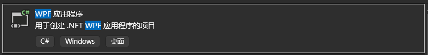
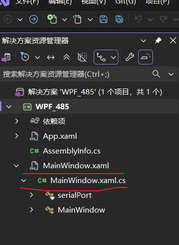

# 
 一 WPF环境搭建 

## 软件安装
    使用软件Visual Studio 2026 ，官网下载安装包，安装时勾选上“.NET桌面开发”和“.NET桌面开发（通用）”两个选项，然后点击“安装”按钮，等待安装完成。
## 项目创建
    安装完成后，打开Visual Studio 2026，点击“创建新项目”按钮，选择“WPF应用程序”模板，然后点击“下一步”按钮，输入项目名称和位置，然后点击“创建”按钮，等待项目创建完成。

## 项目运行
    创建完成后，打开项目文件夹，可以看到项目文件夹下有.xmal文件和.cs文件，双击.xmal文件，可以看到界面布局，双击.cs文件，可以看到界面逻辑，然后点击“运行”按钮，可以看到界面运行效果。.cs文件使用C#语言编写，.xmal文件使用XAML语言编写，XAML语言是一种标记语言，用于描述界面布局，C#语言是一种编程语言，用于编写界面逻辑。
    前后端变量可进行互通，或者在.xmal文件中使用{Binding}的方式进行互通，或者在.cs文件中使用DataContext A.b的方式进行互通。详情可见下一节。

# 
 二 前后端框架介绍 

## 1 .xmal程序框架介绍
## 2 .xmal中添加控件
## 3 .xmal中绑定变量
### 3.1 .xmal中使用{Binding}方式绑定变量
### 3.2 .xmal中使用DataContext A.b方式绑定变量
### 3.3 .xmal中使用{Binding}方式绑定变量的示例
### 3.4 .xmal中使用DataContext A.b方式绑定变量的示例
## 4.C#程序框架介绍
## 5.C#变量属性

# 
  二 WPF中前后端变量绑定 

# 
  三 C#中485通信 

#  
 四 C#中TCP通信 

